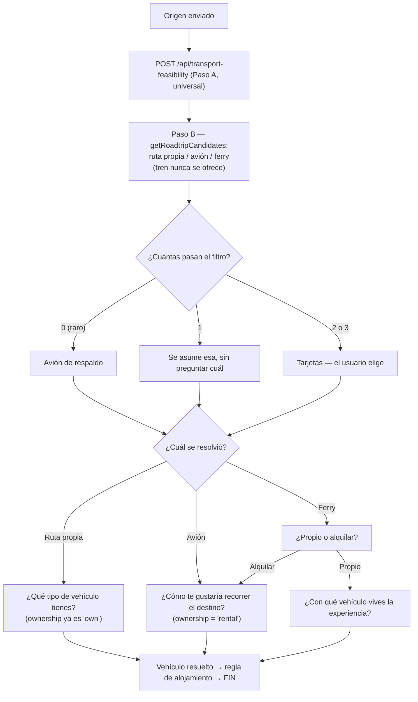
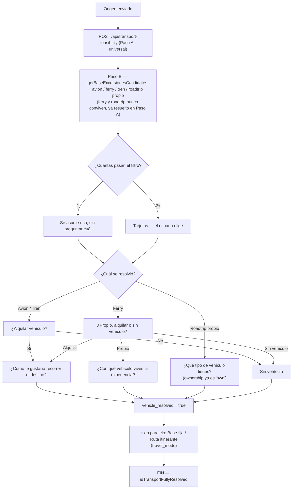
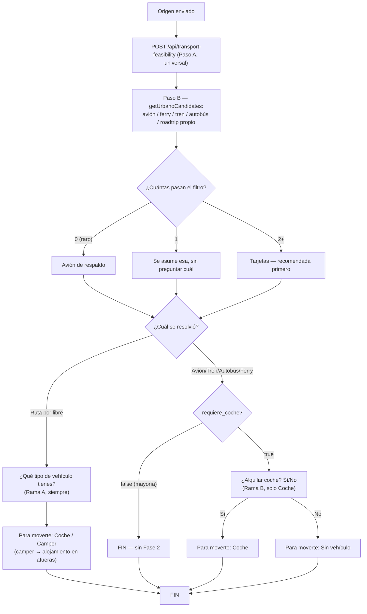
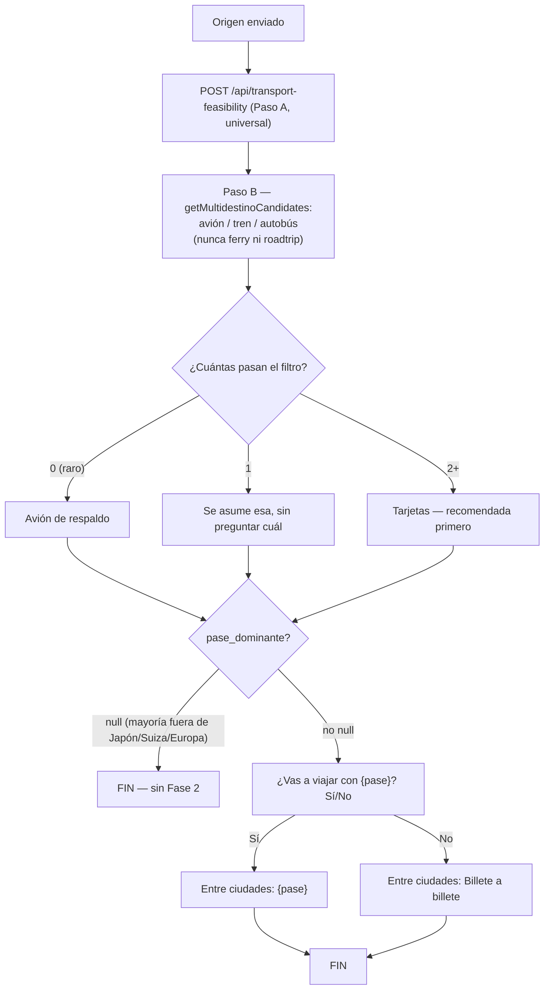

# Flujo de transporte — solo "origen → destino"

Reconstruido desde cero, arquetipo por arquetipo. **Por ahora `roadtrip_exclusivo`,
`base_y_excursiones`, `urbano_clasico`, `multidestino_tren_o_vuelo` y
`multidestino_mixto_o_circuito` tienen lógica propia** — el resto de arquetipos asumen avión
automáticamente sin preguntar nada, como placeholder temporal hasta que les toque su turno.

**`multidestino_tren_o_vuelo` y `multidestino_mixto_o_circuito` son distintos a los demás: parte
de ellos vive fuera de este cuestionario.** Fase 1 (llegada a la primera ciudad/fase) sigue el
mismo patrón que el resto (Fase 2 — pregunta del pase — solo existe en `multidestino_tren_o_vuelo`).
Pero el transporte por cada tramo interno de la ruta ya generada (Paso 4 de `multidestino_tren_o_vuelo`,
Paso 3 de `multidestino_mixto_o_circuito`) se calcula en la fase de generación de ruta y se muestra
intercalado dentro de la ruta, no en el cuestionario — con enlaces de búsqueda genéricos en vez de
monetización real (decisión explícita, ver su sección). El esqueleto de ciudades/fases y noches
sigue explícitamente fuera de alcance, decidido por la IA.

Cubre únicamente desde que se envía el origen hasta que el transporte de llegada (y el vehículo
en destino, si aplica) queda resuelto del todo. Nada de días, fechas ni compañía.

**Arquitectura en 3 capas** (ver detalle más abajo): la viabilidad geográfica (¿hay avión, ferry,
tren, autobús, carretera factible?) es universal y se calcula una sola vez, igual para cualquier
arquetipo — solo el filtro de qué candidatos mostrar depende de cómo se disfruta cada arquetipo.

## Dónde vive el código

| Pieza | Archivo |
|---|---|
| Clasificación de destino (arquetipo + `is_region` + `ambiguous` + `requiere_coche` + `pase_dominante`) | `server/index.js` → `POST /api/classify-destination`, `src/lib/classifyDestination.ts` |
| **Paso A — Endpoint de viabilidad geográfica universal** (solo hechos, sin copy, igual para cualquier arquetipo) | `server/index.js` → `POST /api/transport-feasibility` |
| Hook que lo consume (compartido por los tres arquetipos con lógica propia) | `src/hooks/useTransportFeasibility.ts` |
| Tipo `TransportFeasibility` + copy neutra de las tarjetas (avión/ferry/tren/autobús/vehículo propio) | `src/lib/transportFeasibility.ts` |
| **Paso B — Filtro + copy de `roadtrip_exclusivo`** (`getRoadtripCandidates`; copy de avión propia, presupone conducir; nunca tren ni autobús) | `src/lib/roadtripTransport.ts` |
| Componente del flujo completo de `roadtrip_exclusivo` | `src/components/questionnaire/RoadtripTransportFlow.tsx` |
| **Paso B — Filtro de `base_y_excursiones`** (`getBaseExcursionesCandidates`; reutiliza toda la copy de `transportFeasibility.ts`; no ofrece autobús — no solicitado para este arquetipo) | `src/lib/baseExcursionesTransport.ts` |
| Componente del flujo completo de `base_y_excursiones` | `src/components/questionnaire/BaseYExcursionesTransportFlow.tsx` |
| **Paso B — Filtro de `urbano_clasico`** (`getUrbanoCandidates`; ofrece las cinco vías, incluido autobús y roadtrip con vehículo propio) | `src/lib/urbanoTransport.ts` |
| Componente del flujo completo de `urbano_clasico` (Fase 2: siempre si llegó en vehículo propio, solo si `requiere_coche` en cualquier otro caso) | `src/components/questionnaire/UrbanoTransportFlow.tsx` |
| **Paso B — Filtro de `multidestino_tren_o_vuelo`** (`getMultidestinoCandidates`; solo avión/tren/autobús, nunca ferry ni roadtrip) | `src/lib/multidestinoTrenOVueloTransport.ts` |
| Componente del flujo completo de `multidestino_tren_o_vuelo` (Fase 1 siempre; Fase 2 solo si `pase_dominante`) | `src/components/questionnaire/MultidestinoTrenOVueloTransportFlow.tsx` |
| **Paso 4 — Hechos + filtro por tramo de la ruta ya generada** (`buildTransportSegment`; solo `multidestino_tren_o_vuelo`, calculado en la misma llamada de generación) | `src/lib/cityTransitionTransport.ts` |
| **Paso B — Filtro de `multidestino_mixto_o_circuito`** (Fase 1 de llegada — reutiliza literalmente `getMultidestinoCandidates` de `multidestino_tren_o_vuelo`, "sin cambios" por especificación) | `src/components/questionnaire/MultidestinoMixtoTransportFlow.tsx` |
| **Paso 3 — Hechos + filtro por tramo entre FASES de la ruta ya generada** (`buildPhaseTransportSegment`; solo `multidestino_mixto_o_circuito`; el candidato depende del tipo de cada fase — urbana/naturaleza/isla — ver `legKind`) | `src/lib/phaseTransitionTransport.ts` |
| **Paso 4 — Copy de movilidad local en fase urbana** (Grab explícito para sudeste asiático, genérico el resto — texto fijo en frontend, no decidido por Claude) | `src/lib/urbanPhaseMobility.ts`, renderizado en `src/components/route/DayItinerary.tsx` |
| Componente del tramo intercalado en la ruta generada (antes código muerto — ahora sí se rellena; compartido por `multidestino_tren_o_vuelo` y `multidestino_mixto_o_circuito`) | `src/components/route/TransportSection.tsx` |
| Pregunta de arquetipo ambiguo ("¿Cómo te gustaría vivir {destino}?") | `src/components/questionnaire/OriginInput.tsx` → `ArchetypeChoiceQuestion` |
| Tarjeta de candidato de Fase 1, con la etiqueta "Recomendada" (**compartido, cualquier arquetipo con 2+ candidatos**) | `src/components/questionnaire/TransportOptionCard.tsx` |
| Tarjeta confirmada con check (**compartido, cualquier selector de opción única de la app**) | `src/components/questionnaire/SelectedOptionCard.tsx` |
| Banner de transporte de llegada, construido sobre la tarjeta compartida | `src/components/questionnaire/TransportBanner.tsx` |
| Copy del resumen de alojamiento (**compartido**) | `src/lib/accommodationCopy.ts` |
| Copy de "Base fija"/"Ruta itinerante" adaptada al vehículo (**compartido**) | `src/lib/travelModeCopy.ts` |
| Gate para pasar a "¿Cuántos días?" | `src/lib/transportFlow.ts` → `isTransportFullyResolved` |
| Búsqueda de rutas panorámicas sin geocodificación directa ("¿No encuentras tu destino?") | `src/components/destination/RouteSearch.tsx` |
| Lista curada de rutas + matching | `src/lib/curatedRoutes.ts` |
| Fallback vía Claude para rutas no curadas | `server/index.js` → `POST /api/interpret-route`, `src/lib/interpretRoute.ts` |
| Estado | `useRouteStore`: `archetype`, `is_region`, `archetype_ambiguous`, `requiere_coche`, `pase_dominante`, `travel_pass_confirmed`, `transport_option`, `vehicle_type`, `vehicle_ownership`, `vehicle_resolved`, `travel_mode`, `accommodation_mode`, `known_camper_access` |

**Decisión clave de diseño:** Claude ya no decide qué preguntar ni redacta las tarjetas — eso
era la causa de la inconsistencia anterior (mismo prompt, resultados distintos según el origen).
Ahora Claude solo contesta preguntas de viabilidad con datos (duración/precio); todo el árbol de
preguntas y el copy son código fijo en el frontend.

## Mecánicas de UI genéricas (para TODOS los arquetipos y TODOS los selectores, no solo roadtrip_exclusivo)

Estas reglas de producto no son específicas de "Ruta por libre" — aplican a cualquier arquetipo
y a cualquier selector de opción única de la app, se haya reconstruido ya su lógica o no.
`base_y_excursiones` ya las reutiliza tal cual (no las reimplementa); el resto de arquetipos
pendientes deben hacer lo mismo cuando les toque su turno.

1. **Cada elección resuelta se muestra como tarjeta confirmada con check.** `SelectedOptionCard`
   (prefijo opcional + icono + label + ✓) es el patrón visual estándar para CUALQUIER selector de
   opción única una vez respondido — no solo el transporte de llegada, también el tipo de
   vehículo, la propiedad del vehículo en el ferry, etc. `TransportBanner` es un envoltorio fino
   de esta tarjeta específico para `TransportOption`. En roadtrip_exclusivo el prefijo distingue
   las dos tarjetas que quedan visibles a la vez: **"Para llegar:"** (transporte de llegada) y
   **"Para moverte:"** (vehículo en destino) — nunca "Tu viaje:".
2. **Deshacer una elección.** Siempre que un paso ofrezca 2+ opciones y el usuario ya haya
   elegido una, la tarjeta confirmada incluye un enlace **"Cambiar"** (sin icono, en cursiva —
   nunca el lápiz ✏️) que resetea *solo* esa elección y lo que dependía de ella — nunca el resto
   del formulario. Prop `canChange` en `SelectedOptionCard`/`TransportBanner`. Cuando el sistema
   asumió/forzó la única opción posible sin preguntar (`canChange={false}`), el botón no
   aparece — no hay nada que deshacer.
3. **Explicar el motivo SOLO cuando el resultado fue autoasignado — nunca en una elección
   manual.** Cuando el sistema decide algo por su cuenta sin preguntar al usuario (ej. "coche"
   porque el destino no admite camper/autocaravana), el mensaje nunca muestra solo el resultado
   — antepone el motivo (`buildCarAccommodationMessage(destino, true)`). Pero si el usuario eligió
   él mismo la opción (manualmente, entre 2+ alternativas), NO se muestra ningún texto adicional
   — la tarjeta con check ya es confirmación suficiente y el texto sería redundante.

## Detección de arquetipo (Paso 1) y ambigüedad dinámica

Al confirmar destino, `classifyInBackground` (`src/App.tsx`) llama en paralelo (no bloquea la
navegación) a `POST /api/classify-destination`, que le pide a Claude cuatro campos:
`archetype`, `is_region`, `ambiguous` y `requiere_coche`.

- **`ambiguous = false`** → se usa `archetype` tal cual (`setArchetype`), sin preguntar nada al
  usuario. Caso normal.
- **`ambiguous = true`** → Claude no puede decidir con seguridad entre `roadtrip_exclusivo` y
  `base_y_excursiones` para ese destino concreto (ej. una región que se puede vivir igual de bien
  recorriéndola en coche que quedándose en una base fija). En vez de arriesgar el archetype
  devuelto, `setArchetypeAmbiguous(is_region)` deja `archetype: null` y marca
  `archetype_ambiguous: true`. `OriginInput` renderiza entonces `ArchetypeChoiceQuestion`:
  *"¿Cómo te gustaría vivir {destino}?"* → **🚗 Ruta panorámica en coche** (fija
  `roadtrip_exclusivo`) / **🏡 Explorar sus pueblos y puntos de interés desde una base** (fija
  `base_y_excursiones`), vía `resolveArchetypeChoice`.
- **`requiere_coche`** (añadido 2026-08-30) — solo relevante cuando `archetype = urbano_clasico`;
  el backend lo fuerza a `false` en cualquier otro caso, aunque Claude devuelva otra cosa, como
  defensa adicional. Activa la pregunta de alquiler de coche en la Fase 2 de ese arquetipo — ver
  su sección más abajo.
- **Fallo de la llamada** (`archetype_classification_failed`, añadido 2026-08-30) — antes, si
  `classifyDestination` fallaba (red, servidor, o la API de Claude sin crédito), `archetype`
  quedaba `null` igual que mientras seguía cargando: la UI se quedaba en el spinner *"Viendo qué
  tipo de destino es..."* para siempre, sin distinguir "todavía pensando" de "falló de verdad".
  Ahora `classifyInBackground` (`src/lib/classifyInBackground.ts` — extraída de `App.tsx` a un
  módulo aparte para poder llamarla también desde el botón de reintento) marca
  `setArchetypeClassificationFailed(true)` cuando la llamada no devuelve resultado, y `OriginInput`
  muestra en su lugar *"No hemos podido determinar qué tipo de destino es {destino} ahora
  mismo."* + botón **Reintentar** (vuelve a llamar `classifyInBackground(destination)`). Regla
  general para cualquier estado futuro con esta misma forma: un campo nullable no debe representar
  a la vez "cargando" y "falló" — hace falta un flag de fallo explícito y separado.

**No existe ninguna lista curada fija de destinos ambiguos** — la detección es 100% dinámica,
decidida por Claude en cada destino nuevo según el prompt de clasificación
(`buildClassifyPrompt` en `server/index.js`).

Las rutas panorámicas confirmadas por `RouteSearch` ("¿No encuentras tu destino?") **no** pasan
por esta clasificación: son inequívocamente `roadtrip_exclusivo` y se fijan directas.

## Arquitectura en 3 capas: Feasibility / Filtro por arquetipo / Resolución

Este es el diseño que reemplazó, en la revisión de 2026-08-30, al de "cada arquetipo calcula su
propia geografía". Separa dos preguntas que antes vivían mezcladas en un único prompt por
arquetipo:

1. **¿Cómo llego físicamente de origen a destino?** — depende solo de geografía real (puertos,
   aeropuertos, distancia por carretera). No depende en absoluto de cómo se disfruta el destino.
2. **¿Qué tiene sentido ofrecer, de entre lo que es físicamente posible?** — esto sí depende del
   arquetipo (una ciudad no ofrece "roadtrip con tu coche" aunque la distancia sea corta; una
   ruta por libre nunca ofrece tren aunque exista una estación).

**Paso A — Feasibility (universal, `POST /api/transport-feasibility`).** Calcula avión, ferry,
tren, autobús y carretera con vehículo propio como candidatas independientes, cada una con su
propio `feasible`, más `camper_access` (aptitud del destino para vehículos grandes). Se ejecuta
siempre igual, sea cual sea el arquetipo del destino — el prompt no menciona arquetipos ni estilos
de viaje en ningún momento. Ferry y carretera propia quedan garantizados mutuamente excluyentes
por construcción dentro del propio prompt (una barrera marítima insalvable implica que no puede
existir a la vez un trayecto terrestre completo), así que ningún arquetipo necesita lógica extra
para evitar que convivan como candidatos.

El criterio de cada `feasible` es siempre *"¿esto es lo que un viajero real haría?"*, no *"¿existe
técnicamente la conexión?"*. Esto se aplicó primero a carretera/ferry y se reforzó para **tren**
(2026-08-30) tras detectar que el chequeo era demasiado permisivo: devolvía trenes de 11-13h con
varios trasbordos (ej. Barcelona→Roma) como candidato real solo porque la conexión existía sobre
el papel, aunque nadie la usaría existiendo un vuelo directo de ~2h. Ahora `train.feasible` exige
directo o máximo 1 trasbordo, y una duración total razonable frente al avión (hasta 6-7h cuando
el avión ronda 1-2h; algo más de margen en trayectos medios dentro de un mismo país, donde el
avión también carga con el trayecto al aeropuerto + facturación — ej. Madrid↔Barcelona en AVE
sigue siendo `feasible: true`). **Autobús** (añadido 2026-08-30) sigue el mismo espíritu pero con
más margen — quien elige bus prioriza precio sobre tiempo: directo o máximo 1 trasbordo, hasta
~10-12h de duración total; sigue habiendo límite (`feasible: false` ante un trayecto de 20-30h
existiendo vuelo).

**Paso B — Filtro por arquetipo (`getRoadtripCandidates` / `getBaseExcursionesCandidates` /
`getUrbanoCandidates`, uno por archivo de arquetipo).** Recibe la `TransportFeasibility` del
Paso A y decide qué subconjunto de lo viable tiene sentido *mostrar* — una decisión de producto,
no de geografía:

| Arquetipo | Avión | Ferry | Tren | Autobús | Carretera propia |
|---|---|---|---|---|---|
| `roadtrip_exclusivo` | sí | sí | **nunca** | **nunca** | sí |
| `base_y_excursiones` | sí | sí | sí | **nunca** | sí |
| `urbano_clasico` | sí | sí | sí | sí | sí |

Autobús solo se implementó en el Paso B de `urbano_clasico` — no es que roadtrip_exclusivo o
base_y_excursiones lo excluyan deliberadamente por una regla de producto, simplemente no se pidió
para esos dos (Paso A ya lo calcula de todas formas, disponible para cuando haga falta).

`urbano_clasico` ofrecía carretera propia como **nunca** hasta el 2026-08-30: era un error de
diseño heredado de aplicar una regla de Fase 2 (cómo te mueves *dentro* de la ciudad, donde el
coche no tiene sentido) a una decisión de Fase 1 (cómo *llegas* de una ciudad a otra, donde sí
puede tenerlo — ej. Florencia→Roma, ~3h en coche). Ahora los tres arquetipos con Paso B
implementado usan exactamente el mismo umbral de carretera del Paso A (<12-16h, ruta razonable) —
ninguno tiene ya una exclusión especial de este modo. Solo el tren sigue excluido en
`roadtrip_exclusivo`, porque ahí sí es una decisión de estilo de viaje deliberada ("la carretera
es la experiencia"), no un descuido.

Cada módulo de arquetipo también construye el copy de sus tarjetas — `transportFeasibility.ts`
tiene copy neutra por defecto (reutilizada tal cual por `base_y_excursiones` y `urbano_clasico`);
`roadtrip_exclusivo` sobreescribe solo la de avión porque presupone que el viajero va a conducir
en cuanto aterriza ("recoges tu vehículo"), cosa que no es cierta para los otros dos.

**Paso C — Resolución (sin cambios respecto a antes).** De los candidatos que pasan el filtro
del Paso B: 1 candidato → se asume automático, sin botón "Cambiar". 2+ → tarjetas para elegir,
con "Cambiar" para deshacer. 0 (caso raro) → avión hace de red de seguridad en los tres módulos.

**Etiqueta "Recomendada" (2026-08-30, global — propiedad del sistema de tarjetas, no de cada
arquetipo).** El propio Paso A decide cuál de las vías que marca `feasible: true` es la de mejor
equilibrio duración/precio/comodidad para un viajero medio (no necesariamente la más barata ni la
más rápida a cualquier coste), y le pone `recommended: true` — como mucho una vía por respuesta
(`server/index.js` lo fuerza también en el backend por si Claude marcara más de una). Ese booleano
viaja tal cual hasta `TransportOption.recommended` en cada `build*Option` de
`transportFeasibility.ts`/`roadtripTransport.ts`, así que cualquier arquetipo que reutilice esos
builders lo hereda gratis. `TransportOptionCard` (la tarjeta compartida de Fase 1) pinta la
etiqueta en la esquina superior derecha cuando `option.recommended` es `true` — no hay lógica de
"cuál recomendar" en el frontend ni repetida por arquetipo, todo decidido en el Paso A.

Además, la opción recomendada (si hay alguna) siempre se muestra **primera** en el listado —
`sortByRecommended` (`transportFeasibility.ts`) reordena el array justo antes de que cada
`getXCandidates` lo devuelva, sea cual sea el orden en que Claude haya respondido las vías en el
JSON. El resto de candidatos conserva su orden relativo.

**El bug que motivó este refactor:** Tenerife → Las Palmas tiene un ferry real (Fred
Olsen/Naviera Armas), pero como Las Palmas se clasifica como `urbano_clasico` y ese arquetipo no
tenía todavía su propia lógica de transporte (usaba `PlaceholderTransportFlow`, que asume avión
sin preguntar nada), el ferry nunca llegaba a evaluarse — no porque no existiera, sino porque
nadie había escrito la pregunta para ese arquetipo. Con la geografía ahora desacoplada del
arquetipo, cualquier arquetipo con Paso B implementado hereda automáticamente la geografía real,
sin tener que reimplementarla.

## `roadtrip_exclusivo` (en la app, "Ruta por libre")

### Fase 1 — Cómo llegar: filtro sobre la viabilidad universal (Paso A + Paso B)

La viabilidad geográfica (Paso A, `useTransportFeasibility`) es la misma que consultan
`base_y_excursiones` y `urbano_clasico` — no sabe nada de este arquetipo. Aquí solo se filtra
qué mostrar (Paso B, `getRoadtripCandidates`): ruta con vehículo propio, avión y ferry, **nunca
tren** aunque Paso A lo marque viable — exclusión explícita, no encaja con "la carretera es la
experiencia".

Criterio de Paso A siempre: *"¿esto es lo que un viajero real haría desde este origen
concreto?"*, no *"¿es técnicamente posible?"*. Ante la duda, no se incluye.

Resultado:
- **1 sola vía pasa el filtro** → se asume automáticamente, sin preguntar cuál. En este caso no
  hay botón "Cambiar" — no había nada entre lo que elegir.
- **2 o más pasan el filtro** → se muestran como tarjetas y el usuario elige (ej. Barcelona →
  Dolomitas da exactamente 2: "Avión" y "Ruta por libre desde Barcelona" — nunca ferry, porque
  Dolomitas no tiene costa). Al elegir, el banner **"Para llegar:"** incluye un enlace
  **"Cambiar"** (cursiva, sin icono) para deshacer y volver a las tarjetas, sin perder el resto
  del formulario (origen, días, etc. quedan intactos — solo se resetean `transport_option`,
  `vehicle_type` y `vehicle_ownership`).
- **0 pasan el filtro** (caso raro) → avión hace de red de seguridad.

### Fase 2 — Vehículo (siempre obligatoria, salvo destinos no aptos para camper)

- Llegó por **Ruta por libre con vehículo propio** → *"¿Qué tipo de vehículo tienes?"* → Coche /
  Camper. La propiedad ya se sabe que es suya (`vehicle_ownership = 'own'` se fija al elegir
  esta vía en la Fase 1) — aquí solo falta el tipo, no se vuelve a preguntar propio/alquiler.
- Llegó por **Avión** → *"¿Cómo te gustaría recorrer {destino}?"* → Coche / Camper
  (`vehicle_ownership = 'rental'`).
- Llegó por **Ferry** → primero *"¿Te llevas tu vehículo en el ferry o prefieres alquilar uno
  allí?"*:
  - Propio → *"¿Con qué vehículo vas a vivir esta experiencia?"* → Coche / Camper
    (`vehicle_ownership = 'own'`).
  - Alquilar → *"¿Cómo te gustaría recorrer {destino}?"* → Coche / Camper
    (`vehicle_ownership = 'rental'`).

Nunca hay opción "no necesito vehículo" — en este arquetipo el vehículo es obligatorio siempre.

**Filtro de aptitud para camper/autocaravana:** antes de mostrar cualquiera de las preguntas de
arriba, Claude evalúa por separado si las carreteras del *destino* (no depende del origen)
admiten vehículos grandes con normalidad — `camper_access.feasible`. Si es `false` (ej. Costa
Amalfitana / SS163: curvas cerradas, pasos estrechos, restricciones reales de acceso), la opción
Camper/Autocaravana no se ofrece en ningún punto de la Fase 2: se asume `vehicle_type = 'car'`
directamente, sin preguntar nada. Si es `true` (caso general: Islandia, Dolomitas, Highlands),
las preguntas se muestran normales con las dos opciones.

### Regla de alojamiento (automática, no es una pregunta)

- `vehicle_type = 'car'` → *"Elige tú mismo dónde dormir cada noche, según tu ruta y tu
  presupuesto."* Si el coche vino de la preselección automática por el filtro de camper (no de
  una elección real del usuario), se antepone el motivo: *"{destino} no es apto para camper o
  autocaravana, así que hemos elegido coche por ti 🚗 — elige tú mismo dónde dormir cada noche,
  según tu ruta y tu presupuesto."*
- `vehicle_type = 'camper'` → se bloquean los hoteles: solo campings, áreas homologadas para
  autocaravanas y pernocta (tipo Park4Night).

### Regla de experiencia

Con `archetype = roadtrip_exclusivo`, la opción **"🚗 Ruta por libre"** del selector de
experiencias (`Questionnaire.tsx`) queda fijada automáticamente y bloqueada — no se puede quitar.

## `base_y_excursiones`

Destinos con puntos de interés concentrados y cercanos entre sí, donde el vehículo **mejora** la
experiencia pero **nunca la obliga** — a diferencia de `roadtrip_exclusivo`, donde el vehículo es
siempre obligatorio. Por eso necesita su propio flag `vehicle_resolved` en el store: a diferencia
de roadtrip (donde `vehicle_type !== null` basta para saber si la fase 2 terminó), aquí "sin
vehículo" es un desenlace válido y hay que distinguirlo explícitamente de "todavía sin responder".

### Fase 1 — Cómo llegar: filtro sobre la viabilidad universal (Paso A + Paso B)

Igual viabilidad geográfica (Paso A) que `roadtrip_exclusivo` y `urbano_clasico`. Paso B
(`getBaseExcursionesCandidates`) ofrece cuatro de las cinco vías si Paso A las marca viables —
avión, ferry, tren y roadtrip con vehículo propio (autobús no se pidió para este arquetipo, ver
tabla en la sección de arquitectura) — a diferencia de `roadtrip_exclusivo`, aquí el roadtrip
**no es obligatorio**: es una vía más de llegada, no el propósito del viaje. "Ferry" y "Roadtrip
con vehículo propio" nunca conviven como candidatos separados, pero
eso no es una regla de este arquetipo — ya viene resuelto por Paso A, que los garantiza
mutuamente excluyentes por construcción geográfica (una barrera marítima insalvable implica que
no existe a la vez un trayecto terrestre completo).

Resultado: 1 candidata → se asume automática, sin botón "Cambiar". 2+ → tarjetas para elegir, con
el botón de volver atrás ya implementado globalmente. 0 (caso raro) → avión hace de red de
seguridad.

### Fase 2 — Vehículo (siempre opcional, nunca obligatorio)

- Llegó por **Avión o Tren** → *"¿Te gustaría alquilar un vehículo en {destino}?"* Sí/No.
  - Sí → *"¿Cómo te gustaría recorrer {destino}?"* → Coche/Camper/Autocaravana (filtrado por
    `camper_access`, igual que en roadtrip_exclusivo). `vehicle_ownership = 'rental'`.
  - No → sin vehículo, `vehicle_resolved = true` con `vehicle_type: null` — fin de esta fase.
- Llegó por **Ferry** → *"¿Vienes con tu propio vehículo, prefieres alquilar uno en destino, o
  vas sin vehículo?"* (3 opciones).
  - Propio → *"¿Con qué vehículo vas a vivir esta experiencia?"* → filtrado.
    `vehicle_ownership = 'own'`.
  - Alquilar → *"¿Cómo te gustaría recorrer {destino}?"* → filtrado. `vehicle_ownership =
    'rental'`.
  - Sin vehículo → `vehicle_resolved = true` con `vehicle_type: null` — fin.
- Llegó por **Roadtrip con vehículo propio** → el vehículo ya se sabe que es suyo
  (`vehicle_ownership = 'own'` se fija al elegir esta vía en la Fase 1) — solo pregunta el tipo,
  filtrado, sin volver a preguntar propio/alquiler.

El mismo filtro de aptitud para camper/autocaravana de roadtrip_exclusivo (`camper_access`)
aplica igual aquí: si el destino no admite vehículos grandes, se fuerza `vehicle_type = 'car'`
automáticamente en cualquiera de las ramas de arriba, con el texto explicando el motivo
(`buildCarAccommodationMessage`), igual que en roadtrip_exclusivo.

### Experiencia en destino (siempre en paralelo, independiente del vehículo)

*"¿Cómo prefieres explorar {destino}?"* → **Base fija** / **Ruta itinerante** (`travel_mode`).
No depende de la Fase 2 — se puede responder en cualquier momento, y ambas deben estar resueltas
(`vehicle_resolved && travel_mode !== null`) para que `isTransportFullyResolved` deje pasar a
"¿Cuántos días?".

**Copy adaptada al vehículo ya elegido** (`getTravelModeDescription` en
`src/lib/travelModeCopy.ts`, compartida — no es específica de este arquetipo, cualquier otro que
pregunte Base fija/Ruta itinerante debe reutilizarla): con `vehicle_type = 'camper'` la
descripción habla de campings y zonas de pernocta ("Un solo camping o zona de pernocta como
base..." / "Cambias de camping y zonas de pernocta..."); en cualquier otro caso (coche, sin
vehículo, o mientras el vehículo todavía no está resuelto — esta pregunta es independiente y
puede responderse antes) se usa la copy genérica de alojamiento ("Un solo alojamiento..." /
"Cambias de zona...").

## `urbano_clasico`

Ciudades donde te mueves a pie y en transporte público — **Fase 2 es la excepción, no la norma**:
en la inmensa mayoría de ciudades no hay ninguna pregunta de vehículo (`buildArchetypeContext` en
el backend prohíbe sugerir coche de alquiler salvo que el viajero haya alquilado uno explícitamente
— ver más abajo; la excepción de siempre son las excursiones de un día completo fuera de la
ciudad, que llevan su propio transporte incluido, ej. Pompeya desde Roma).

### Fase 1 — Cómo llegar: filtro sobre la viabilidad universal (Paso A + Paso B)

Misma viabilidad geográfica (Paso A) que los otros dos arquetipos. Paso B
(`getUrbanoCandidates`) ofrece las **cinco vías** si Paso A las marca viables — **incluido
ferry**, aunque el destino sea una ciudad: si está en una isla y depende de una conexión marítima
real (ej. Las Palmas de Gran Canaria, alcanzable en ferry desde Tenerife), esa es la vía real y se
ofrece igual que a cualquier otro arquetipo. **Incluida también carretera con vehículo propio**
(desde el 2026-08-30) cuando el trayecto es razonable en coche — ej. Florencia→Roma. **Incluido
autobús** (mismo día, único arquetipo con esta vía activada en su Paso B) — ej. Barcelona→Madrid,
que con esto pasa a mostrar hasta 4 candidatos a la vez (avión/tren/autobús/ruta propia).

Resultado: 1 candidata → se asume automática. 2+ → tarjetas para elegir, con la recomendada
siempre primera. 0 (caso raro) → avión hace de red de seguridad.

### Fase 2 — dos ramas independientes, nunca simultáneas

**Rama A — llegó por "Ruta por libre con vehículo propio"** (añadido 2026-08-31): siempre
pregunta *"¿Qué tipo de vehículo tienes?"* → Coche / Camper, exactamente igual que en
`roadtrip_exclusivo`/`base_y_excursiones` (filtrado por `camper_access`, con el mismo auto-forzado
a Coche si el destino no admite camper) — sin importar `requiere_coche`, porque el viajero ya
tiene un vehículo real, solo falta saber cuál. Con Camper, el alojamiento deja de ser el hotel
céntrico habitual: `describeAccommodationType` devuelve aparcamiento/camping en las **afueras**,
elegido por buena conexión de transporte público al centro (no en mitad de la nada, tampoco en el
centro) — mismo criterio de "camping/áreas homologadas, nunca hotel" que el resto de arquetipos,
adaptado a que aquí sí hace falta moverse por la ciudad en transporte público desde el camping.
`buildArchetypeContext` distingue este caso explícitamente: dentro de la ciudad, a pie/transporte
público como cualquier visitante — nunca conducir la autocaravana por el centro.

**Aviso universal para Camper/Autocaravana (añadido 2026-08-31):** siempre que
`vehicle_type === 'camper'` en `urbano_clasico` — sea cual sea la ciudad, sin depender de ningún
campo de clasificación — se muestra el mismo texto fijo: *"En {destino} tu camper/autocaravana se
quedará aparcada en una zona periférica con buena conexión — te recomendamos moverte por el
centro a pie o en transporte público."* Deliberadamente no condicionado a nada (ni a si el centro
histórico es "complicado" ni a la ciudad concreta): en cualquier ciudad grande un vehículo de ese
tamaño se queda fuera del centro por norma general, así que no hace falta ningún chequeo por
destino. Vive al final del componente (`UrbanoTransportFlow.tsx`), fuera de las dos ramas de Fase
2, para que aplique igual sea cual sea la que produjo el Camper (hoy solo la Rama A, pero no
depende de eso).

**Rama B — cualquier otra llegada** (avión/tren/autobús/ferry): solo si `requiere_coche = true`
(ver más abajo) pregunta *"El transporte público en {destino} es limitado — ¿te gustaría alquilar
un coche para moverte con comodidad?"* → Sí/No, sin preguntar el tipo (nunca Camper/Autocaravana
aquí — parte de cero, sin vehículo propio que arrastrar, se fija `vehicle_type = 'car'` directo).
Sin cambios respecto a como se implementó primero (2026-08-30):
- Sí → `vehicle_ownership = 'rental'`, tarjeta confirmada "Para moverte: Coche".
- No → sin vehículo, respetando la decisión — tarjeta confirmada "Para moverte: Sin vehículo".

Ambas ramas marcan `vehicle_resolved = true` al terminar (mismo flag que usa base_y_excursiones,
para distinguir "resuelto sin vehículo" de "todavía sin responder"); `isTransportFullyResolved`
usa `transportOption.id === 'own_vehicle'` para decidir cuál de las dos ramas aplica.

**`requiere_coche`** — cuarto campo en la clasificación de destino (Paso 1), true solo cuando un
visitante no puede apoyarse en el transporte público para llegar a los puntos de interés
turísticos dispersos por el área metropolitana (no basta con que exista transporte en el centro).
Perfil (true): Los Ángeles, Phoenix, Miami, Orlando, Tampa y en general las ciudades de baja
densidad del "Sun Belt" estadounidense, ciudades australianas medianas. false en la inmensa
mayoría (Roma, París, Tokio, Nueva York, Barcelona, San Francisco, Chicago...) — incluidas
ciudades de área metropolitana enorme cuyo transporte sí conecta bien los puntos de interés.
Calibrado el 2026-08-31 tras detectar que Miami salía `false` a pesar de encajar en el mismo
perfil que Los Ángeles/Phoenix — el criterio original solo hablaba de "transporte en el centro",
lo que hacía que Claude valorara demasiado el metro/Metromover de Miami sin considerar que no
conecta con South Beach, Wynwood, Coconut Grove, etc. Verificado con Miami/Orlando/Tampa/Houston/
Dallas/Las Vegas/Atlanta (`true`) y con San Francisco/Chicago/Londres/Berlín (`false`, sin
sobrecorrección).

## `multidestino_tren_o_vuelo`

Cadena de ciudades homogénea en cuanto a transporte — el viaje se mueve por tren o vuelo interno
entre ciudades, nunca coche. Ejemplos: Japón (JR Pass), Interrail Europa, corredor Nueva
York-Washington-Boston.

### Fase 1 — Cómo llegar a la primera ciudad: filtro sobre la viabilidad universal (Paso A + Paso B)

Misma viabilidad geográfica (Paso A) que el resto de arquetipos. Paso B
(`getMultidestinoCandidates`) ofrece Avión / Tren / Autobús — **nunca ferry, nunca roadtrip con
vehículo propio**: ninguno de los dos encaja en un arquetipo diseñado explícitamente para no
depender de coche en ningún tramo, ni el de llegada ni los de entre ciudades.

Resultado: 1 candidata → se asume automática. 2+ → tarjetas para elegir, con la recomendada
siempre primera. 0 (caso raro) → avión hace de red de seguridad.

### Fase 2 — Pregunta del pase de transporte, una sola vez

`pase_dominante` — quinto campo en la clasificación de destino (Paso 1), string o `null`. Nombre
del pase que la mayoría de turistas usa para moverse por este destino, SI existe uno claramente
dominante (`"JR Pass"` para Japón, `"Swiss Travel Pass"` para Suiza, `"Eurail/Interrail Global
Pass"` cuando el itinerario cruza varios países europeos). `null` cuando no hay ninguno lo
bastante dominante como para asumirlo por defecto (ej. Corea del Sur, Taiwán, EE.UU. — ahí la
norma real es comprar billete a billete). Verificado: Japón → "JR Pass", Suiza → "Swiss Travel
Pass", Interrail Europa → "Eurail/Interrail Global Pass", Corea del Sur → `null`.

- **`pase_dominante = null`** (caso normal en destinos sin un pase dominante real) → sin
  preguntar nada, la fase termina en cuanto hay `transport_option`.
- **`pase_dominante` no es `null`** → tras resolver Fase 1, pregunta *"¿Vas a viajar con
  {pase_dominante}?"* → Sí/No, una sola vez para todo el viaje (`travel_pass_confirmed` en el
  store, no se vuelve a preguntar tramo a tramo). Confirmada como tarjeta con prefijo "Entre
  ciudades:" — *"{pase_dominante}"* si Sí, *"Billete a billete"* si No.

Esta decisión se pasa a la fase de generación de ruta (`transportContext.pase_dominante` +
`travel_pass_confirmed`, ver `TransportContext` en `types.ts`) para que Claude tenga en cuenta si
debe favorecer/mencionar el pase o comprar billete a billete al describir los trayectos entre
ciudades — pero la decisión de **qué ciudades visitar y cuántas noches en cada una** (Paso 3 del
prompt original de este arquetipo) es responsabilidad exclusiva de esa fase de generación, fuera
del alcance de este documento: aquí no se pregunta nada sobre el esqueleto del viaje.

### Paso 3 — esqueleto de ciudades y noches: fuera del alcance de este documento

Explícitamente fuera de alcance por instrucción del propio pedido — qué ciudades visitar y
cuántas noches en cada una lo decide la fase de generación de ruta con IA. Este cuestionario no
pregunta nada al usuario sobre el esqueleto del viaje.

### Paso 4/5 — transporte por tramo dentro de la ruta ya generada, con monetización genérica

Construido el 2026-08-31, **sin monetización real** (decisión explícita del usuario — ver más
abajo). Vive fuera de la Fase 1/2 de este documento: se calcula en la MISMA llamada de generación
de ruta (no en el cuestionario), y se muestra intercalado dentro de la ruta ya generada, no
durante las preguntas de "¿Desde dónde viajas?".

- **`ROUTE_SYSTEM_PROMPT`** (`server/index.js`) ahora pide un campo `city` por día (solo difiere
  del destino global en arquetipos multi-ciudad). `buildArchetypeContext` añade, solo para
  `multidestino_tren_o_vuelo`, la instrucción de incluir también un array `city_transitions` en
  la misma respuesta JSON — un hecho por cada cambio de ciudad detectado en el itinerario que la
  propia IA acaba de diseñar (día, ciudad origen/destino del tramo, y **tren/vuelo/autobús como
  vías independientes** con su propio `feasible`+duración+precio, más `recommended` y, si hay un
  pase activo, `pass_covers_leg`). Mismo espíritu que el Paso A de Fase 1 ("¿esto es lo que un
  viajero real haría?"), pero calculado por la propia IA que ya conoce las ciudades concretas del
  itinerario, en vez de una llamada aparte — evita N llamadas extra tras generar la ruta.
  Sanitizado en el backend (`sanitizeCityTransitions`) antes de responder.
- **`src/lib/cityTransitionTransport.ts`** — Paso B de cada tramo (`buildTransportSegment`),
  mismo principio que `getRoadtripCandidates`/`getUrbanoCandidates` pero aplicado a un tramo
  entre ciudades de la ruta generada en vez de la Fase 1 de llegada:
  - Pase activo Y cubre el tramo → resuelto automáticamente con el pase, sin alternativas, sin
    "Cambiar" (nada que deshacer).
  - Pase activo pero NO cubre el tramo → excepción: nunca se oculta, se avisa (*"Este tramo no lo
    cubre bien tu {pase} — aquí compensa volar"*) y se resuelve directo con vuelo interno como
    única alternativa real.
  - Sin pase (o el viajero no lo usa) → Tren y Vuelo compiten como candidatos reales, filtrados
    por su propio `feasible` — **nunca autobús como tercera tarjeta normal**. 1 candidata → se
    asume automática (igual que Fase 1). 2 → tarjetas para elegir.
  - Si ni tren ni vuelo son razonables para ese tramo concreto → autobús como única alternativa
    real, resuelto automáticamente con el motivo siempre visible (*"Aquí no hay tren ni vuelo
    directo con sentido — la opción real es autobús."*).
- **`src/components/route/TransportSection.tsx`** (reescrito, antes código muerto — ver más
  abajo) — se renderiza en la posición ya existente al inicio de cada día
  (`DayItinerary.tsx`, sin cambios ahí), justo donde `day.transport` esté presente: candidatos
  como tarjetas cuando hay elección real, o el resultado resuelto con el motivo si fue forzado,
  con "Cambiar" solo cuando hubo alternativas reales entre las que elegir.
- **Monetización — deliberadamente genérica, no real** (`buildSearchUrl` en
  `cityTransitionTransport.ts`): no existe ningún programa de afiliación (Skyscanner/
  Travelpayouts) en la app, así que en vez de fabricar enlaces oficiales que podrían ser
  incorrectos, cada opción enlaza a una búsqueda de Google genérica (Google Flights para vuelo;
  búsqueda normal para tren/autobús/pase). Cuando haya credenciales de afiliación reales, solo
  hay que sustituir esta función — el resto del sistema (hechos por tramo, filtro, UI) no cambia.

**Por qué se llegó a esta decisión de alcance:** antes de construir nada, se comprobó que
`TransportSegment`/`TransportSection.tsx` ya existían en el código pero eran código muerto —
`DayPlan.transport` nunca se rellenaba (el mapeador de la respuesta de Claude no construía ese
campo, y el prompt de generación de ruta no lo incluía en su JSON de salida), y no había ninguna
integración de afiliación de vuelos en ningún punto de la app (comprobado por grep en todo `src/`
y `server/` — cero coincidencias de "skyscanner"/"travelpayouts"/"affiliate"). Se presentó esto al
usuario en vez de construir a medias o inventar una integración que no existía; se eligió
construir el sistema completo (hechos por tramo + filtro + UI) con enlaces genéricos, dejando la
monetización real como sustitución futura de una sola función cuando haya credenciales.

## `multidestino_mixto_o_circuito`

Construido el 2026-08-30. Circuito de fases de naturaleza DISTINTA entre sí — ciudad, naturaleza
(zona remota, normalmente sin aeropuerto/tren/autobús público que llegue bien) e isla — en
cualquier orden y combinación. Ejemplos: Tailandia, Vietnam, Malasia, Perú, Colombia.

**Fase 1 (llegada)** es idéntica a `multidestino_tren_o_vuelo` por especificación explícita ("sin
cambios") — `MultidestinoMixtoTransportFlow.tsx` reutiliza literalmente `getMultidestinoCandidates`
en vez de duplicar el filtro. Sin Fase 2 en el cuestionario: a diferencia del pase de
`multidestino_tren_o_vuelo`, aquí el resto de decisiones de transporte dependen de fases que
todavía no existen en este punto (las decide la generación de ruta).

**Paso 2 (esqueleto de fases)** fuera del alcance de este documento, igual que el esqueleto de
ciudades de `multidestino_tren_o_vuelo` — lo decide la generación de ruta.

**Paso 3 — transporte entre cada par de fases consecutivas, dentro de la ruta ya generada:**

- `buildArchetypeContext` (`server/index.js`) pide, para este arquetipo, un `phase_type`
  (`"urbana" | "naturaleza" | "isla"`) por día además del `city` ya existente, y un array
  top-level `phase_transitions` (misma llamada de generación, mismo principio que
  `city_transitions`: la IA que ya diseñó el itinerario es quien mejor conoce sus fases
  concretas). Cada entrada trae potencialmente seis vías (tren/vuelo/autobús/ferry/transfer
  organizado/roadtrip de alquiler), pero la IA solo debe rellenar como viables las que tengan
  sentido real para ese PAR de tipos de fase concreto — el resto se dejan `feasible: false`.
  Sanitizado en el backend (`sanitizePhaseTransitions`).
- **`src/lib/phaseTransitionTransport.ts`** — Paso B de cada tramo (`buildPhaseTransportSegment`).
  El tipo de las dos fases decide qué candidatos importan (`legKind`), sin confiar solo en que la
  IA haya dejado en `false` lo que no aplica (defensa en profundidad, igual que el resto de la
  app):
  - **Urbana↔Urbana** → Avión/Tren/Autobús compiten como candidatos normales (igual que
    `urbano_clasico`).
  - **Cualquier fase↔Isla** → solo Ferry o Avión — coche/transfer nunca cruzan a una isla.
  - **Urbana↔Naturaleza o Naturaleza↔Naturaleza** → Transfer organizado / Roadtrip de alquiler /
    Autobús (solo si existe línea pública real) compiten, con "Recomendada" decidiendo cuál
    destacar. El roadtrip de alquiler ofrece **Coche** siempre que sea viable, y además
    **Camper/Autocaravana** solo si la IA marca la región como `apto_camper_autocaravana` — por
    defecto NO (la mayoría de destinos de este arquetipo no tienen esa cultura), con excepciones
    reales tipo Costa Rica o Nueva Zelanda. Se guarda en qué ciudad se recoge y en qué ciudad se
    devuelve el vehículo de alquiler (`TransportSegment.rentalPickupCity`/`rentalReturnCity`,
    mostrado en la UI cuando difieren) — la lógica de cargo por devolución en otra ciudad
    ("one-way fee") queda sin resolver a propósito, solo el dato ya vive en la estructura.
  - 1 candidato viable → se asume automático (igual que Fase 1). 2+ → tarjetas para elegir. 0
    (caso raro) → candidato de seguridad con el motivo siempre visible.
- **`TransportSection.tsx`** es el MISMO componente que ya renderizaba el Paso 4 de
  `multidestino_tren_o_vuelo` — no hizo falta ningún componente nuevo, solo ampliar
  `TransportMode` con `'transfer'` y completar los iconos que antes solo cubrían tren/vuelo/
  autobús (`transportModeIcon` en `cityTransitionTransport.ts`, ahora con los siete modos reales).

**Paso 4 — movilidad local en fase urbana:** copy fija en frontend (`src/lib/urbanPhaseMobility.ts`),
mostrada una vez al llegar a cada fase urbana (`DayItinerary.tsx`, comparando con el día anterior
para no repetirla cada día de la estancia) — menciona Grab explícitamente cuando el destino es
Malasia/Tailandia/Vietnam/Filipinas/Singapur/Indonesia, genérica (a pie/transporte público/taxi)
en el resto. Deliberadamente en frontend, no en el prompt de Claude — mismo principio de "Claude
solo devuelve hechos, el copy es código fijo" que el resto de la app.

**Paso 5 (alojamiento):** fuera del alcance de este bloque, ya cubierto por
`describeAccommodationType` en `server/index.js` (un alojamiento distinto por fase, con el tipo
correspondiente).

**Paso 6 — monetización del Transfer organizado:** igual criterio que el pase de
`multidestino_tren_o_vuelo` — sin integración real (no hay programa de afiliados de 12Go Asia ni
similar todavía), enlace de búsqueda genérico de Google mencionando 12Go Asia. El roadtrip de
alquiler (coche/camper) también usa un enlace de búsqueda genérico, por consistencia con el resto
de vías resueltas de la app (todas llevan un `searchUrl`).

## Rutas panorámicas sin geocodificación directa ("¿No encuentras tu destino?")

Mapbox no puede geocodificar corredores como "Ruta 66" o "Ruta 40" (son carreteras, no puntos).
Bajo el buscador de destino hay un enlace que abre una caja de texto libre para este caso —
independiente de `DestinationChips`/autocompletado normal.

1. El usuario escribe texto libre (ej. "ruta 40 argentina").
2. Se comprueba primero contra `rutasCuradas` (`src/lib/curatedRoutes.ts`, 12 rutas documentadas
   con `punto_inicio`, `punto_fin`, `duracion_tipica_dias` y `apto_camper_autocaravana`) —
   matching exacto o por contención contra `nombre`/`nombres_alternativos`, normalizando acentos
   y mayúsculas. Sin llamada a Claude si hay coincidencia.
3. Si no hay coincidencia curada, fallback a Claude (`POST /api/interpret-route`) — devuelve
   nombre oficial, país/región, punto de inicio/fin y duración típica, o `reconocida: false` si
   no lo reconoce con seguridad (nunca inventa). El fallback de Claude **no** evalúa aptitud para
   camper — queda como "desconocido" (`camperAccess: null`) y se pregunta con normalidad en la
   Fase 2, como cualquier otro destino.
4. **Siempre** se muestra una tarjeta de confirmación antes de continuar — nunca se asume
   automáticamente: *"¿Te refieres a {nombre}, en {país} — normalmente de {inicio} a {fin}?"* →
   [Sí, es esta] / [No, buscar otra].
5. Al confirmar, se geocodifica el punto de inicio vía Mapbox (`searchPlaces`) y se usa como
   `destinationPlace` — es el punto de llegada real (el usuario vuela/conduce hasta ahí y luego
   empieza la ruta). El nombre oficial de la ruta se usa como `destination`. El arquetipo se fija
   directo a `roadtrip_exclusivo` (`is_region: true`) sin pasar por `/api/classify-destination`
   — una ruta panorámica confirmada es inequívocamente de este tipo. A partir de ahí sigue el
   flujo normal de Fase 1/2 ya descrito arriba, con `known_camper_access` (si venía de la lista
   curada) sustituyendo la pregunta de aptitud para camper en `RoadtripTransportFlow`.

## Otros arquetipos (pendientes)

`expedicion_o_crucero`: sin flujo propio todavía. En cuanto se envía el origen, se asume avión
automáticamente (sin preguntar) y la fase se da por resuelta al
instante, para no bloquear el resto del cuestionario. Se irán reconstruyendo uno a uno, con la
misma metodología (Paso A universal ya construido y reutilizable desde el primer día; cada uno
solo necesita escribir su propio Paso B).
